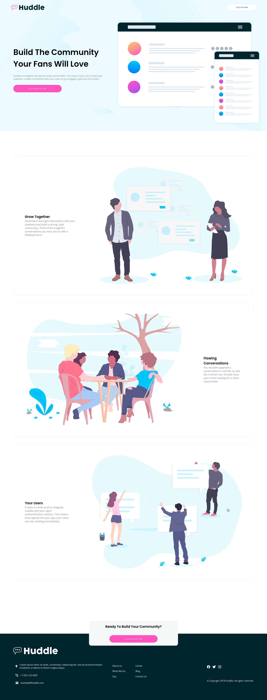

# Frontend Mentor - Huddle landing page with alternating feature blocks solution

This is a solution to the [Huddle landing page with alternating feature blocks challenge on Frontend Mentor](https://www.frontendmentor.io/challenges/huddle-landing-page-with-alternating-feature-blocks-5ca5f5981e82137ec91a5100). Frontend Mentor challenges help you improve your coding skills by building realistic projects. 

## Table of contents

- [Overview](#overview)
  - [The challenge](#the-challenge)
  - [Screenshot](#screenshot)
- [My process](#my-process)
  - [Built with](#built-with)
  - [What I learned](#what-i-learned)
  - [Continued development](#continued-development)
  - [Useful resources](#useful-resources)
- [Author](#author)

**Note: Delete this note and update the table of contents based on what sections you keep.**

## Overview

### The challenge

Users should be able to:

- View the optimal layout for the site depending on their device's screen size
- See hover states for all interactive elements on the page

### Screenshot

## My process

I started my process by setting up all the elements on HTML first. Making sure all the images and SVG's were visible. I then went ahead and worked on the CSS, while also switching between screen sizes to make sure my code was compatible on smaller screens. 

### Built with

- Semantic HTML5 markup
- CSS custom properties
- Flexbox
- Mobile-first workflow

### What I learned

Being my first Junior level challenge, this landing page took a while to get the basic layout together. After a few tries and a few days, I was able to complete the task and come up with a few solutions that ultimately let me finish the project and let me replicate it as close as possible. 
I mostly struggled with the container that is in the middle of the page, for I didnt know if I should've flexbox on the whole page or not to center it.
Another struggle I had was getting the logo to turn white instead of green. The SVGs were also new and a bit of a struggle

### Continued development

I feel like finishing this project significally helped my flexbox skills. I am looking forward to working on more projects like this in the future, while also adding grid to my arsenal.

### Useful resources

- [Open AI](https://chat.openai.com) - I used ChatGPT to help me analyze my code and let me know if I was practicing good coding practices.
- [Mozilla Developer](https://developer.mozilla.org) - I will always recommend MDN to anyone who needs a reference on HTML/CSS/Javascript best practices.

## Author

- Frontend Mentor - [@Jxnfernandx](https://www.frontendmentor.io/profile/Jxnfernandx)
- GitHub - [Jxnfernandx](https://github.com/Jxnfernandx)

